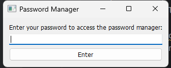

# Password Manager created with PyQt5

A simple password manager created with PyQt5.

## How to use it?

1. Install [Python](https://www.python.org/downloads/)
2. Install [PyCharm](https://www.jetbrains.com/pycharm/) or [Visual Studio Code](https://code.visualstudio.com/download)
3. Install PyQt5:
   - Open terminal and write `pip install pyqt5`

Once you have downloaded everything, you can launch the application.

## How it works

After you have installed all the necessary software, you can launch the application. You will see a small window where you need to enter your password, which you specify in the code.

If you enter the correct password, you will see a window with your passwords, which you can also change in the code:

If your password is incorrect, you will see this window:

Maybe in the future, I will improve this project to make it work better!

©prod by cywe