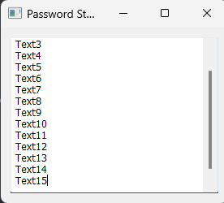
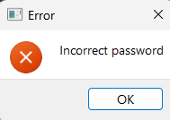

# Password Manager created with pyQT5
simple password manager created with pyqt5

## How it works

## How to use it?

1. Install [python](https://www.python.org/downloads/)
2. Install [PyCharm](https://www.jetbrains.com/pycharm/) or [Visual Studio Code](https://code.visualstudio.com/download)
3. Install PyQT5
   - open terminal and write `pip install pyqt5`

when you download all, you can also work with this

## How it works

After you have downloaded everything you need, then you can launch the application

You will see a small window where you need to enter your password, which you specify in the code.

If you have entered the correct password, you will see a window with your passwords, which you can change also in the code

If your password is wrong you will have this window

Maybe in the future I will improve this project to make it work better!

©prod by cywe